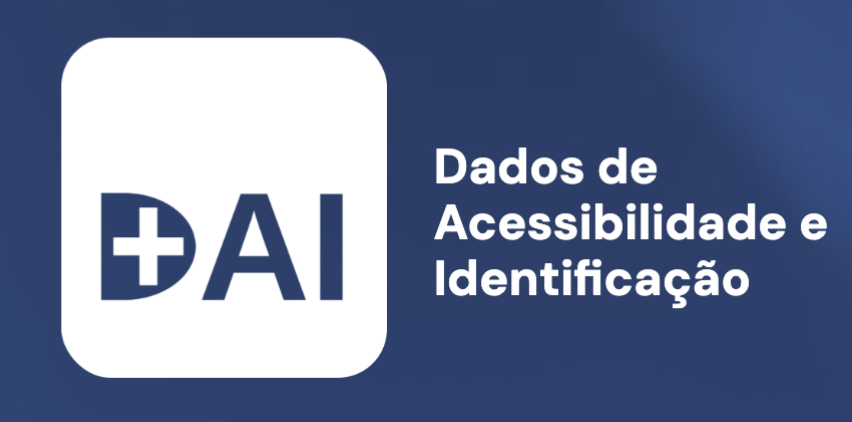
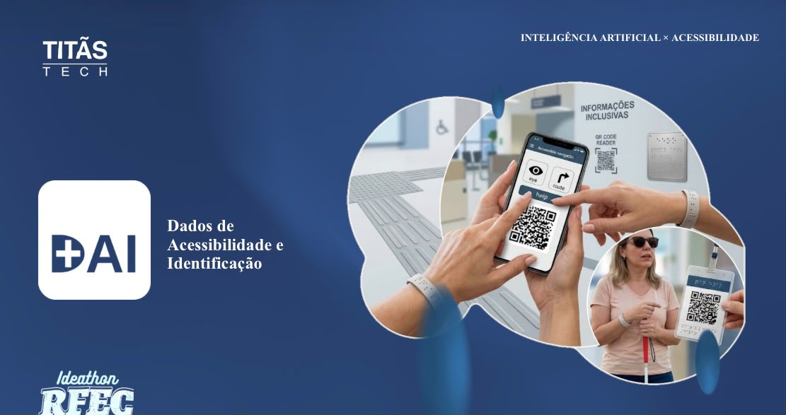
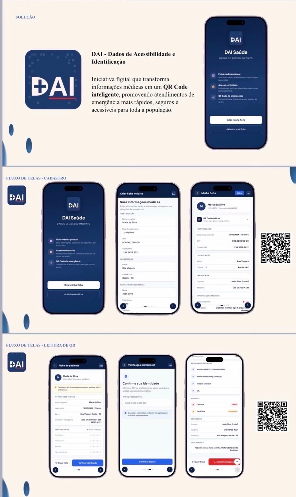
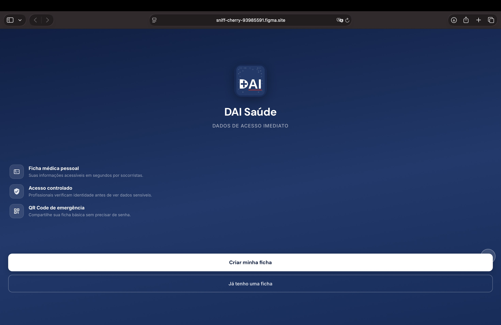
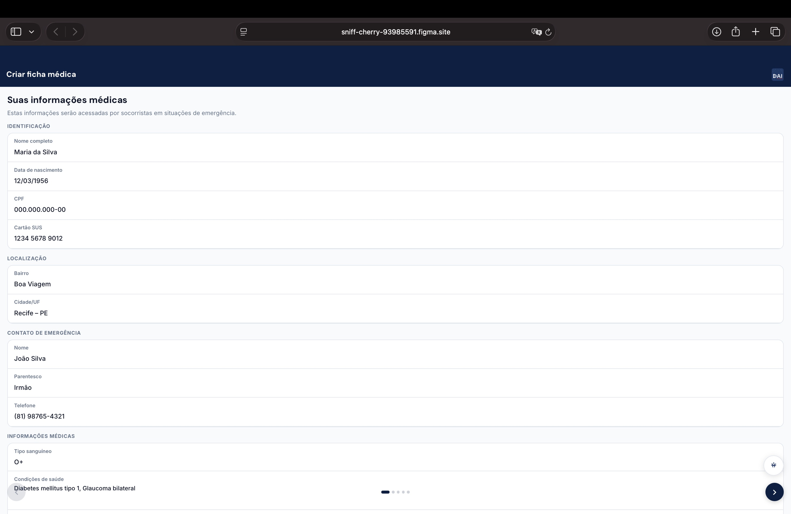
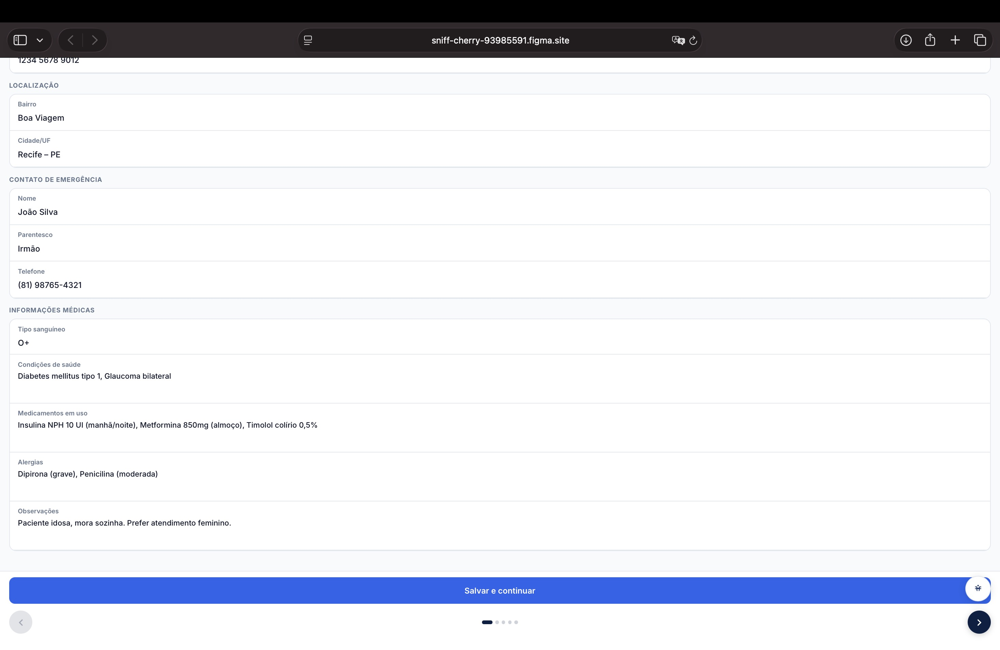
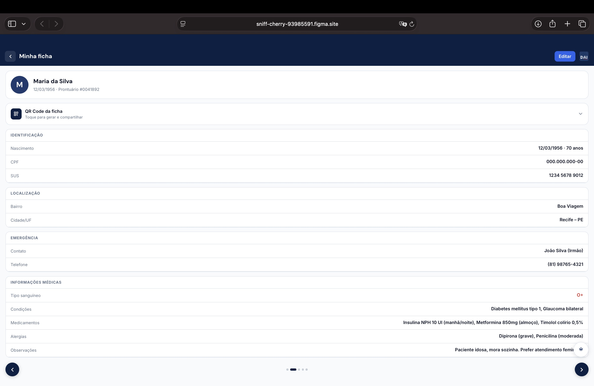
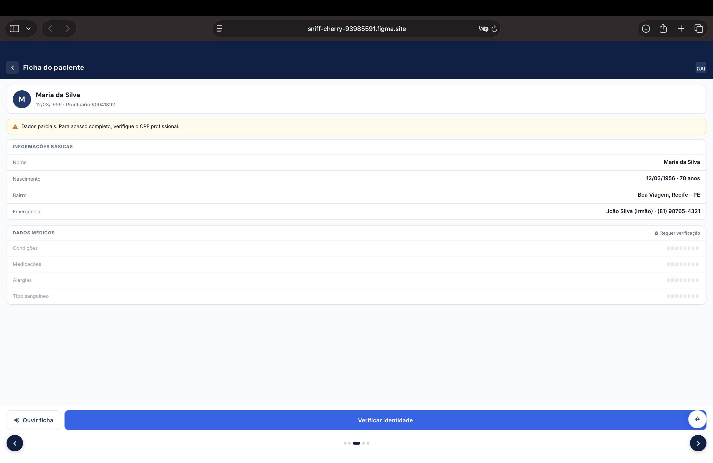
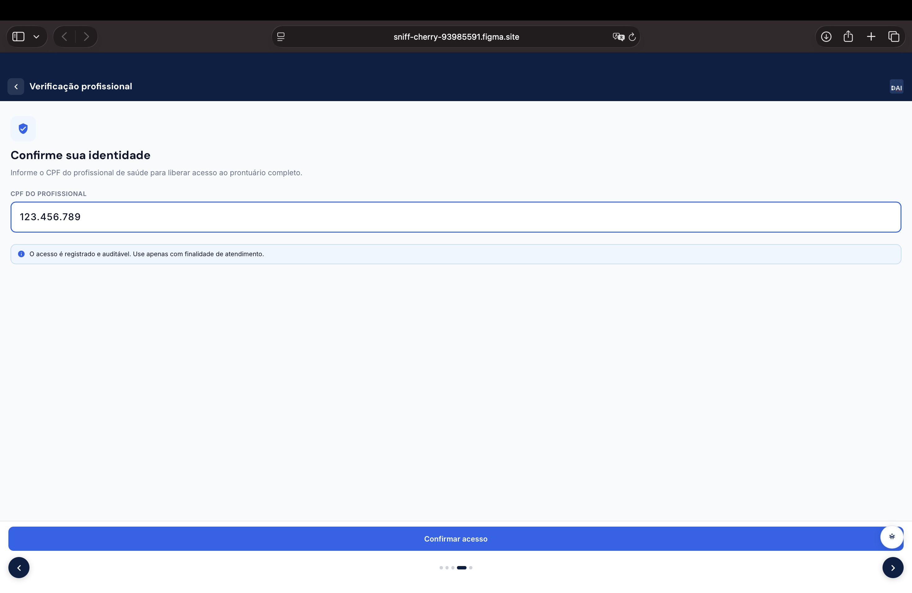
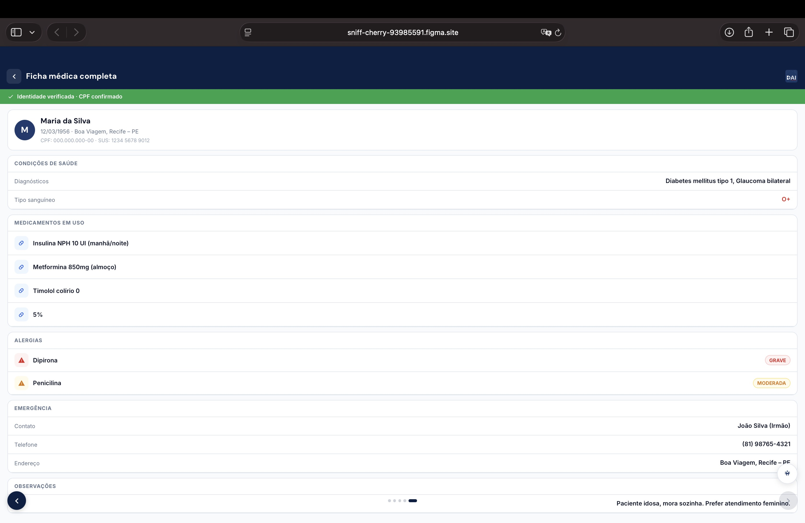

<h1 align="center">Ideathon Rfec 2026.2: <i>DAI</i> - Dados de Acessibilidade e Identificação  
</h1>

    
  

<i><b>Equipe Titãs Tech no Ideathon RFEC 2026.2</b> — <b>01/08/2026</b></i>

<h2 align="center">📌 Sobre o Projeto  </h2>

O **Ideathon RFEC 2026.2** propôs o desafio: *"Como a Inteligência Artificial pode promover acessibilidade no Mundo Digital?"*. A equipe **Titãs Tech** respondeu com o **DAI — Dados de Acessibilidade e Identificação**, uma iniciativa **figital** (físico + digital) que transforma informações médicas essenciais em um **QR Code inteligente**, permitindo atendimentos de emergência mais rápidos, seguros e acessíveis para toda a população — com foco especial em pessoas com deficiência visual.

<h2 align="center">🚨 O Problema</h2>

Em uma emergência, quem não enxerga bem também tem dificuldade em se explicar. Os dados que motivaram o projeto:

- **2,2 bilhões** de pessoas vivem com alguma deficiência visual no mundo *(OMS — World Report on Vision, 2019)*
- **6,5 milhões** de brasileiros têm deficiência visual, o que dificulta a comunicação em momentos críticos *(IBGE — PNS, 2019)*
- **90%** da perda visual severa é evitável ou tratável, mas o socorro depende de informação rápida *(OMS, 2019)*
- **Recife** é a **9ª capital brasileira** com maior número de pessoas com deficiência: **182 mil pessoas** *(Plano Recife 500 Anos)*

A pergunta que guiou a solução: **como garantir que informações essenciais de saúde e acessibilidade estejam disponíveis rapidamente em situações de emergência?**

<h2 align="center">💡 A Solução</h2>

O **DAI** é uma ficha médica figital, no cartão que a pessoa já carrega. Ela preenche uma vez, em um sistema navegável, suas informações essenciais — que se transformam em um **QR Code impresso na carteirinha**, lido por qualquer smartphone em segundos.

**Informações disponíveis na ficha:**
- 🩺 **Condição** — diagnóstico, alergias e medicações de uso contínuo
- 📞 **Contato de confiança** — nome e telefone, acionado com um toque
- 📍 **Endereço** — localização para orientar o socorro

**Camadas de acesso:**
- **Ficha médica pessoal** — informações acessíveis em segundos por socorristas
- **Acesso controlado** — profissionais verificam identidade (CPF) antes de visualizar dados sensíveis, com acesso registrado e auditável
- **QR Code de emergência** — ficha básica compartilhável sem necessidade de senha

<h2 align="center">📱 Fluxo de Telas  </h2>

  

- **Cadastro**: criação da ficha médica com identificação, localização e contato de emergência.
- **Leitura de QR**: o socorrista escaneia o código, visualiza os dados básicos e, ao verificar sua identidade profissional, desbloqueia o prontuário completo (medicações, alergias e observações).

<h2 align="center">🖥️ Protótipo Navegável  </h2>

  
  
  

Capturas de tela do protótipo funcional, do cadastro da ficha médica até o desbloqueio auditado do prontuário completo:

<table align="center" width="780">
  <tr><th align="center">🏠 Tela Inicial</th></tr>
  <tr><td align="center"><b>Landing do DAI Saúde, apresentando as três camadas de acesso: ficha médica pessoal, acesso controlado e QR Code de emergência.</b></td></tr>
  <tr><td align="center"></td></tr>
</table>

 

<table align="center" width="780">
  <tr><th align="center">📝 Cadastro da Ficha Médica</th></tr>
  <tr><td align="center"><b>Formulário em duas etapas: identificação (nome, data de nascimento, CPF, cartão SUS, bairro e cidade) e dados médicos (contato de emergência, tipo sanguíneo, condições de saúde, medicamentos, alergias e observações).</b></td></tr>
  <tr><td><table width="100%"><tr>
    <td align="center"></td>
    <td align="center"></td>
  </tr></table></td></tr>
</table>

 

<table align="center" width="780">
  <tr><th align="center">👤 Minha Ficha</th></tr>
  <tr><td align="center"><b>Visão completa do próprio paciente sobre seus dados, com QR Code pronto para gerar e compartilhar.</b></td></tr>
  <tr><td align="center"></td></tr>
</table>

 

<table align="center" width="780">
  <tr><th align="center">🚑 Ficha do Paciente</th></tr>
  <tr><td align="center"><b>Ao escanear o QR Code, o socorrista vê apenas os dados básicos — dados médicos sensíveis permanecem bloqueados até a verificação de identidade.</b></td></tr>
  <tr><td align="center"></td></tr>
</table>

 

<table align="center" width="780">
  <tr><th align="center">🔐 Verificação Profissional</th></tr>
  <tr><td align="center"><b>O socorrista informa o CPF profissional para solicitar acesso auditável aos dados sensíveis do paciente.</b></td></tr>
  <tr><td align="center"></td></tr>
</table>

 

<table align="center" width="780">
  <tr><th align="center">✅ Ficha Completa</th></tr>
  <tr><td align="center"><b>Identidade verificada: condições de saúde, medicamentos, alergias e observações são liberados por completo, com acesso registrado e auditável.</b></td></tr>
  <tr><td align="center"></td></tr>
</table>

## 📈 Impacto Esperado

- ⚡ **Socorro mais rápido**
- ✅ **Menos erros médicos**
- 🏥 **Alívio para a rede** de saúde
- 🧍 **Autonomia** para quem não consegue comunicar suas próprias informações

## ✨ Nosso Diferencial

- Democratizamos o acesso à ficha médica em segundos
- Reduzimos o erro médico causado por falta de informação
- Ampliamos a segurança de quem se perde em espaços públicos
- Garantimos autonomia a quem não consegue ler ou comunicar a própria informação

**Modelo de negócio:** B2B + B2G2C — figital, sustentável, adaptável e escalável.

> *"A acessibilidade não começa quando a pessoa chega ao hospital. Ela começa quando todos têm a mesma chance de serem atendidos com rapidez, dignidade e segurança."*

<h2 align="center">👤👨‍🎓 Integrantes do Projeto: </h2>
<ul>
<li><b>Juliana Freire (Lider 👑)</b> </li>
<li>Alany Siqueira  </li>
<li>Larissa Almeida  </li>
<li>Lucas Paguetti Pereira  </li>
<li>Rodrigo Vasco  </li>
</ul>

<h2 align="center"> ⛏️💻 Tecnologias Utilizadas: </h2>

  
  
  
  

